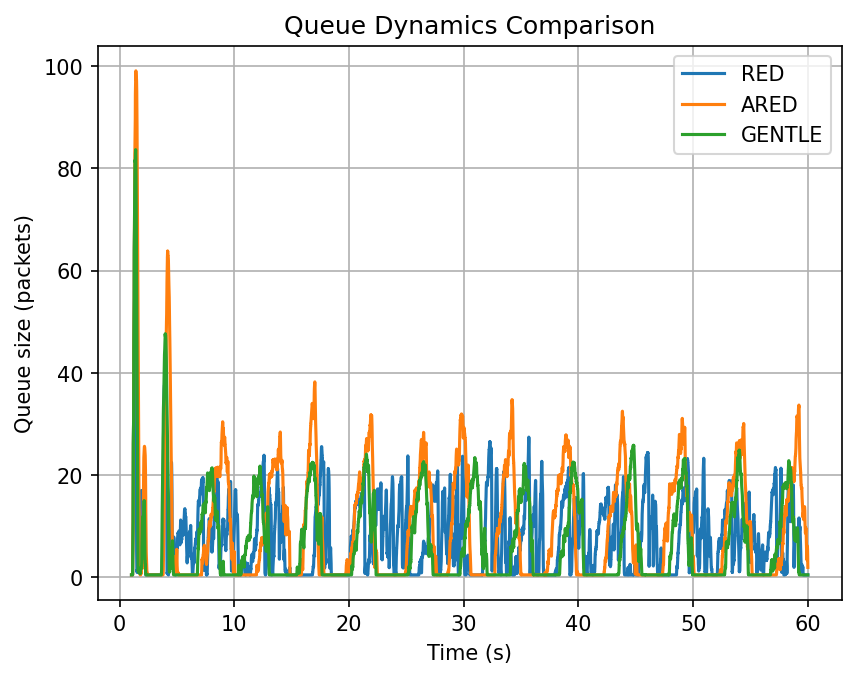
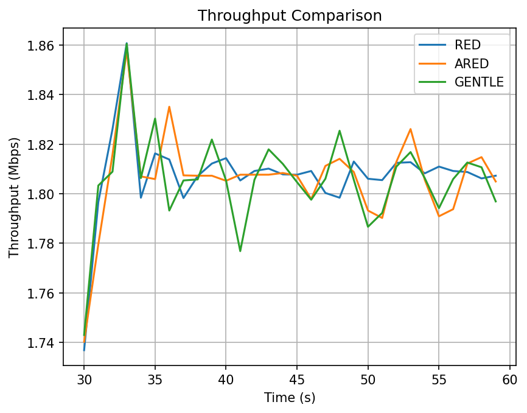
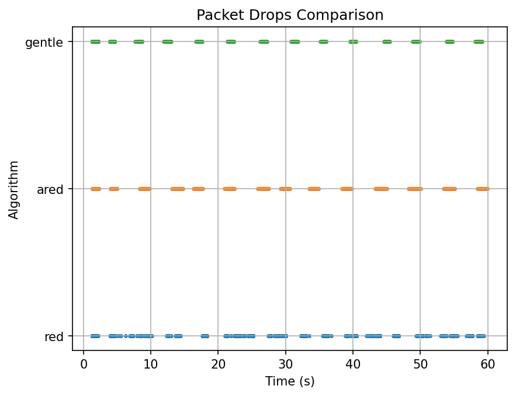

# Сравнительный анализ алгоритмов AQM: RED, ARED, Gentle RED

**Симулятор:** ns-3, программа `red.cc`  
**Топология:** 10 отправителей → маршрутизатор (AQM) → 1 получатель  
**Узкое место:** 2 Мбит/с, задержка 10 мс | **Быстрые каналы:** 1 Мбит/с, задержка 2 мс  
**Пороги:** minTh = 5 пакетов, maxTh = 10 пакетов, MaxSize = 100 пакетов  
**Длительность:** 59 секунд (первая секунда — прогрев, исключена из анализа)  
**Транспорт:** TCP BulkSend, размер сегмента 512 байт  

---

## Введение

### Управление активными очередями (AQM)

Традиционный подход к управлению перегрузкой в маршрутизаторах — дроп хвоста (tail-drop): пакеты отбрасываются только тогда, когда буфер полностью заполнен. Это приводит к глобальной синхронизации TCP-потоков, резким осцилляциям пропускной способности и постоянно переполненному буферу. Алгоритмы активного управления очередями (AQM, Active Queue Management) решают эту проблему, начиная отбрасывать или помечать пакеты _заблаговременно_ — до того, как буфер переполнится — на основании статистики средней длины очереди. TCP-соединения получают сигнал о перегрузке раньше и плавнее снижают скорость отправки, не доводя ситуацию до коллапса.

### RED (Random Early Detection)

RED — базовый алгоритм AQM, предложенный Флойдом и Якобсоном в 1993 году. Алгоритм вычисляет экспоненциально взвешенное скользящее среднее длины очереди и принимает решение о сбросе на его основе.

**Обновление средней очереди** при каждом поступающем пакете:

$$\bar{q} \leftarrow (1 - w_q)\,\bar{q} + w_q\,q$$

где $q$ — текущая (мгновенная) длина очереди, $w_q \in (0,1)$ — вес фильтра (чем меньше, тем медленнее реакция).

**Вероятность сброса** определяется тремя зонами:

$$p(\bar{q}) = \begin{cases} 0 & \bar{q} < \mathrm{minTh} \\ p_b = \mathrm{maxP} \cdot \dfrac{\bar{q} - \mathrm{minTh}}{\mathrm{maxTh} - \mathrm{minTh}} & \mathrm{minTh} \le \bar{q} < \mathrm{maxTh} \\ 1 & \bar{q} \ge \mathrm{maxTh} \end{cases}$$

Жёсткий принудительный сброс выше $\mathrm{maxTh}$ обеспечивает быстрое реагирование, но синхронизирует TCP-потоки и создаёт пилообразные осцилляции очереди.

### ARED (Adaptive RED)

ARED расширяет RED адаптивным механизмом: параметр $\mathrm{maxP}$ периодически пересчитывается через каждые $T_{\mathrm{interval}}$ в зависимости от того, насколько средняя очередь отклоняется от целевого диапазона $[\mathrm{minTh},\, \mathrm{maxTh}]$:

$$\mathrm{maxP} \leftarrow \begin{cases} \mathrm{maxP} + \alpha & \bar{q} > \dfrac{\mathrm{minTh} + \mathrm{maxTh}}{2} \\[6pt] \mathrm{maxP} - \beta & \bar{q} < \dfrac{\mathrm{minTh} + \mathrm{maxTh}}{2} \end{cases}$$

где $\alpha$ и $\beta$ — коэффициенты увеличения и снижения вероятности ($\alpha > \beta$, чтобы алгоритм быстрее реагировал на перегрузку, чем отступал от неё). Значение $\mathrm{maxP}$ ограничивается снизу и сверху, не выходя за допустимый диапазон. Во всём остальном ARED использует ту же формулу вероятности, что и RED, но с текущим адаптированным $\mathrm{maxP}$. Это позволяет алгоритму приспосабливаться к меняющейся нагрузке без ручной настройки, однако адаптация вносит дополнительную инерцию и может приводить к более широким колебаниям очереди.

### Gentle RED

Gentle RED модифицирует поведение RED в зоне выше $\mathrm{maxTh}$: вместо немедленного принудительного сброса алгоритм продолжает вероятностный подход вплоть до $2 \cdot \mathrm{maxTh}$:

$$p(\bar{q}) = \begin{cases} 0 & \bar{q} < \mathrm{minTh} \\[4pt] \mathrm{maxP} \cdot \dfrac{\bar{q} - \mathrm{minTh}}{\mathrm{maxTh} - \mathrm{minTh}} & \mathrm{minTh} \le \bar{q} < \mathrm{maxTh} \\[8pt] \mathrm{maxP} + (1 - \mathrm{maxP}) \cdot \dfrac{\bar{q} - \mathrm{maxTh}}{\mathrm{maxTh}} & \mathrm{maxTh} \le \bar{q} < 2\,\mathrm{maxTh} \\[4pt] 1 & \bar{q} \ge 2\,\mathrm{maxTh} \end{cases}$$

В зоне $[\mathrm{maxTh},\, 2\cdot\mathrm{maxTh})$ вероятность линейно растёт от $\mathrm{maxP}$ до $1$, а принудительный сброс происходит лишь при $\bar{q} \ge 2\cdot\mathrm{maxTh}$. Это смягчает реакцию на кратковременные всплески очереди, снижает синхронизацию TCP-потоков и уменьшает среднюю длину очереди — ценой несколько большей вариабельности пропускной способности.

### Параметры эксперимента

В данном эксперименте все три алгоритма работают с одинаковыми порогами очереди: `minTh = 5`, `maxTh = 10`, `MaxSize = 100` пакетов. Нагрузка создаётся 10 параллельными TCP BulkSend-потоками через узкое место 2 Мбит/с. Это создаёт устойчивую конкуренцию за ресурс канала и позволяет наблюдать характерные различия между алгоритмами в установившемся режиме.

---

## План проведения эксперимента

### Цель

Сравнить три алгоритма AQM — RED, ARED и Gentle RED — в условиях устойчивой перегрузки узкого места и оценить их поведение по трём метрикам: динамика очереди, пропускная способность и характер сбросов пакетов.

### Топология сети

```
[Sender 1]──┐
[Sender 2]──┤          ┌──[Receiver]
   ...       ├──[Router (AQM)]──┤
[Sender 10]─┘          └──────────
```

- **Каналы отправителей:** 1 Мбит/с, задержка 2 мс
- **Узкое место:** 2 Мбит/с, задержка 10 мс
- **Транспорт:** TCP BulkSend, размер сегмента 512 байт, 10 параллельных потоков

### Конфигурация алгоритмов

Все три алгоритма запускаются с одинаковыми параметрами очереди:

| Параметр  | Значение |
|-----------|----------|
| `minTh`   | 5 пакетов |
| `maxTh`   | 10 пакетов |
| `MaxSize` | 100 пакетов |

Отличие только в логике управления вероятностью сброса (см. Введение).

### Описание параметров конфигурации

#### Инфраструктура

| Параметр | По умолчанию | Описание |
|---|---|---|
| `senderNetworkBase` | `10.1.0.0` | Базовый адрес подсетей на стороне отправителей. Каждому отправителю назначается адрес из этого диапазона. |
| `receiverNetworkBase` | `10.2.0.0` | Базовый адрес подсети на стороне получателя. |
| `subnetMask` | `255.255.255.0` | Маска подсети для всех интерфейсов. |

Эти параметры влияют только на адресацию и маршрутизацию — на поведение AQM не влияют.

#### Топология

| Параметр | По умолчанию | Описание |
|---|---|---|
| `nSenders` | `10` | Количество TCP-отправителей. Увеличение создаёт более высокую нагрузку на узкое место и усиливает конкуренцию за буфер. |
| `fastRate` | `1Mbps` | Скорость каналов отправитель → маршрутизатор. Должна быть ≥ `bottleneckRate / nSenders`, иначе узким местом станет канал отправителя, а не буфер AQM. Задержка на этих каналах фиксирована: 2 мс. |
| `bottleneckRate` | `2Mbps` | Скорость узкого канала маршрутизатор → получатель. Определяет максимальную суммарную пропускную способность системы и степень перегрузки при заданном `nSenders`. |
| `bottleneckDelay` | `10ms` | RTT-компонента узкого канала. Влияет на скорость реакции TCP на сигналы о перегрузке: большая задержка → медленнее TCP снижает окно → AQM дольше «держит» перегруженную очередь. |

#### AQM

| Параметр | По умолчанию | Описание |
|---|---|---|
| `aqm` | `RED` | Тип алгоритма: `RED`, `ARED` или `GENTLE`. Выбирает логику вычисления вероятности сброса (см. Введение). |
| `minTh` | `5.0` | Нижний порог средней очереди (пакеты). При `m_qAvg < minTh` сбросов нет совсем. Увеличение позволяет очереди расти глубже без реакции — снижает число сбросов, но увеличивает задержку. |
| `maxTh` | `15.0` | Верхний порог средней очереди (пакеты). При `m_qAvg ≥ maxTh` RED/ARED сбрасывают все пакеты принудительно; Gentle RED переходит в линейную зону до `2·maxTh`. Расстояние `maxTh − minTh` определяет «крутизну» нарастания вероятности. |
| `maxSize` | `100` | Жёсткий лимит буфера (пакеты). Пакеты, поступающие в полный буфер, всегда отбрасываются независимо от алгоритма. Должен быть > `2·maxTh`, иначе физический лимит буфера будет достигнут раньше, чем AQM успеет сработать. |

#### Симуляция

| Параметр | По умолчанию | Описание |
|---|---|---|
| `simTime` | `10.0` | Длительность симуляции в секундах. Первая секунда (фаза медленного старта) исключается из анализа. Рекомендуемое минимальное значение — 30 с: при коротких прогонах ARED может не успеть стабилизировать `maxP`. |

#### Выходные файлы

| Параметр | По умолчанию | Что пишется |
|---|---|---|
| `queueLogFile` | `queue.csv` | Мгновенная длина очереди (пакеты), раз в 100 мс: `время,длина` |
| `dropLogFile` | `drops.csv` | Метка времени каждого сброса пакета: `время,1` |
| `throughputLogFile` | `throughput.csv` | Пропускная способность на выходе (Мбит/с), раз в 100 мс: `время,мбит/с` |

### Шаги проведения

1. **Подготовка конфигураций.** Для каждого алгоритма создаётся отдельный конфигурационный файл (`configs/red.txt`, `configs/ared.txt`, `configs/gentle.txt`) с указанием типа AQM и единых параметров очереди.

2. **Запуск симуляций.** Скрипт `run_simulations.sh` последовательно запускает три симуляции в ns-3:
   ```bash
   ./ns3 run "scratch/red-experiments/red.cc --config=configs/<алгоритм>.txt"
   ```
   Каждая симуляция длится 60 секунд. Первая секунда (фаза медленного старта) исключается из анализа.

3. **Сбор логов.** По завершении каждой симуляции три CSV-файла перемещаются в директорию `analysis/`:
   - `<алгоритм>_queue.csv` — длина очереди, раз в 100 мс
   - `<алгоритм>_drops.csv` — метки времени каждого сброса пакета
   - `<алгоритм>_throughput.csv` — пропускная способность на выходе, раз в 100 мс

4. **Визуализация и анализ.** Скрипт `analysis/vis.py` загружает все шесть CSV-файлов, строит три сравнительных графика со сглаживанием скользящим средним (окно 30 отсчётов) и сохраняет их в `analysis/`:
   ```bash
   python vis.py --algorithms red ared gentle --window 30
   ```

### Метрики оценки

| Метрика | Источник данных | Что характеризует |
|---|---|---|
| Средняя и медианная длина очереди | `*_queue.csv` | Средняя задержка в буфере |
| p90 / p99 длины очереди | `*_queue.csv` | Хвостовые задержки |
| Доля времени с пустой очередью | `*_queue.csv` | Недоиспользование канала |
| Средняя пропускная способность | `*_throughput.csv` | Утилизация канала |
| Коэффициент вариации пропускной способности | `*_throughput.csv` | Стабильность потока |
| Общее число сбросов | `*_drops.csv` | Нагрузка на TCP-механизм перегрузки |
| Медиана интервала между сбросами | `*_drops.csv` | Характер управляющих сигналов |

---

## 1. Динамика очереди (`queue.png`)



На графике чётко выделяются две фазы.

**Фаза медленного старта (t = 0–4 с).** Все TCP-соединения одновременно входят в slow-start и за секунды насыщают буфер. Очередь у всех алгоритмов достигает пиковых значений: ARED — до 100 пакетов, RED и Gentle RED — до 84 пакетов. Этот выброс одинаков для всех трёх, поскольку алгоритм AQM ещё не успел накопить статистику и среагировать.

**Установившийся режим (t > 5 с).** После рассасывания начального всплеска алгоритмы расходятся в поведении.

- **RED** (синяя кривая) удерживает очередь в диапазоне 5–26 пакетов с относительно регулярными осцилляциями. Кривая редко касается нуля (пустая очередь лишь 13.4% времени) — принудительный сброс при `m_qAvg ≥ maxTh` реагирует быстро и держит очередь «в узде», но ценой постоянного давления на TCP-потоки.

- **ARED** (оранжевая кривая) демонстрирует наибольшую амплитуду колебаний и наиболее хаотичный рисунок. Периодически очередь вырастает до 30–35 пакетов в установившемся режиме и резко обваливается к нулю. Это следствие адаптации `maxP`: алгоритм поочерёдно «отпускает» и «закручивает» вероятность сброса, порождая широкие и нерегулярные циклы. p99 = 49 пакетов — самое высокое значение среди трёх алгоритмов.

- **Gentle RED** (зелёная кривая) чаще остальных возвращается к нулю (26.6% времени очередь пуста, медиана = 1 пакет). Плавная вероятностная функция в зоне `[maxTh, 2·maxTh]` позволяет TCP-потокам десинхронизировать свои окна: часть потоков тормозит, остальные продолжают заполнять буфер, что приводит к более глубоким, но менее длительным «провалам» очереди.

| Алгоритм | Среднее (пкт) | Стд. откл. | Медиана | p90 | p99 | Пустая (%) |
|----------|---------------|------------|---------|-----|-----|------------|
| RED      | 7.74          | 7.45       | 6       | 18  | 26  | 13.4%      |
| ARED     | **9.57**      | **11.94**  | 4       | 25  | **49** | 22.3%   |
| Gentle   | **6.40**      | 8.86       | **1**   | 19  | 34  | **26.6%**  |

### Зоны работы EWMA-средней очереди (m_qAvg)

| Алгоритм | < minTh | [minTh, maxTh) | [maxTh, 2·maxTh) | ≥ 2·maxTh |
|----------|---------|----------------|------------------|-----------|
| RED      | 46.0%   | 19.8%          | 29.3%            | 4.8%      |
| ARED     | 52.6%   | 8.0%           | 19.6%            | **19.7%** |
| Gentle   | **60.8%** | 11.8%        | 19.8%            | 7.7%      |

RED проводит 34.1% времени в зоне принудительного сброса (`m_qAvg ≥ maxTh`), что объясняет его высокую среднюю очередь. ARED проводит 19.7% времени в зоне `m_qAvg ≥ 2·maxTh`, где дропаются все пакеты — отсюда его аномально высокое p99. Gentle RED чаще всего находится ниже minTh (60.8%) и реже всего попадает в зону жёстких сбросов (7.7%).

---

## 2. Пропускная способность (`throughput.png`)



График построен с применением скользящего среднего с окном 30 отсчётов, поэтому отображает данные начиная с t ≈ 29 с. Ось Y намеренно сжата до диапазона 1.74–1.86 Мбит/с, что позволяет рассмотреть различия, невидимые на полной шкале.

Все три алгоритма стабильно удерживают пропускную способность вблизи **1.80–1.81 Мбит/с** (~90% от номинала канала 2 Мбит/с). Это означает, что выбор алгоритма AQM при данных параметрах не влияет на утилизацию полосы: все три механизма одинаково эффективно «заполняют» канал.

Характерный пик около t = 33 с (все кривые достигают ~1.86 Мбит/с) — синхронное восстановление TCP-потоков после первоначальной волны сбросов: окна конгестии одновременно начинают расти, создавая кратковременный избыточный поток.

| Алгоритм | Среднее (Мбит/с) | Стд. откл. | Мин.  | Макс. | КВ    |
|----------|------------------|------------|-------|-------|-------|
| RED      | 1.8047           | 0.3380     | 0.533 | 3.621 | **18.7%** |
| ARED     | 1.8039           | 0.3950     | 0.553 | 3.293 | 21.9% |
| Gentle   | 1.7998           | **0.4444** | 0.352 | 3.654 | **24.7%** |

Несмотря на одинаковое среднее, **RED демонстрирует наименьшую вариабельность** (CV = 18.7%): жёсткий синхронный сброс держит все TCP-потоки в такт, делая пропускную способность предсказуемой. Gentle RED имеет наибольший CV (24.7%) — асинхронное управление окнами создаёт большую «рябь», хотя среднее значение от этого не страдает. ARED на графике заметно «гуляет» относительно RED и Gentle — его кривая не следует за ними синхронно, что отражает независимость адаптации `maxP` от мгновенного состояния очереди.

---

## 3. Сбросы пакетов (`drops.png`)



График представляет моменты сбросов в виде точечной диаграммы: каждая точка — один сброшенный пакет. Три горизонтальные полосы соответствуют трём алгоритмам.

**RED** (нижняя полоса, синий) — самая плотная и непрерывная полоса: точки заполняют практически всё время симуляции, лишь с редкими небольшими просветами. Это соответствует статистике — RED активно дропает в 47 из 58 секунд со средним интервалом между сбросами всего **2.3 мс** (медиана). Принудительный сброс при `m_qAvg ≥ maxTh` создаёт непрерывный поток отброшенных пакетов каждый раз, как средняя очередь превышает порог.

**ARED** (средняя полоса, оранжевый) — чётко видны кластеры сбросов, разделённые заметными паузами. Алгоритм активен в 33 из 58 секунд (на 30% меньше, чем RED). Адаптация `maxP` периодически снижает вероятность сброса до нуля, давая потокам «передышку», — отсюда промежутки без точек. Однако когда сбросы происходят, их плотность внутри кластера высока (максимальный всплеск — 276 сбросов за секунду, средний всплеск — 30.4/с).

**Gentle RED** (верхняя полоса, зелёный) — наиболее выраженная кластерная структура с самыми длинными паузами между кластерами. Алгоритм активен лишь в 27 из 58 секунд. Внутри каждого кластера сбросы плотные (средний всплеск — 38.0/с, максимальный — 305/с), однако между ними — длительные «тихие» промежутки. Плавная вероятностная функция позволяет TCP-потокам гибко регулировать скорость, поэтому система либо в режиме активного управления перегрузкой, либо полностью «спокойна».

| Алгоритм | Всего сбросов | Частота (сбр./с) | Медиана интервала | Активных секунд | Макс. всплеск |
|----------|---------------|------------------|-------------------|-----------------|---------------|
| RED      | **1240**      | **21.34**        | **2.3 мс**        | **47**          | 321           |
| ARED     | 1003          | 17.11            | 11.3 мс           | 33              | 276           |
| Gentle   | 1026          | 17.75            | 9.1 мс            | **27**          | 305           |

RED генерирует на **19–21% больше сбросов**, чем конкуренты. Критически важно, что медиана интервала между сбросами у RED (2.3 мс) в 4–5 раз меньше, чем у ARED и Gentle. Это означает, что RED практически непрерывно дропает пакеты в периоды перегрузки, тогда как ARED и Gentle работают «импульсами».

---

## 4. Сводная таблица

| Метрика                          | RED              | ARED             | Gentle RED       |
|----------------------------------|------------------|------------------|------------------|
| Средняя пропускная способность   | 1.8047 Мбит/с    | 1.8039 Мбит/с    | 1.7998 Мбит/с    |
| Стабильность пропуск. способности | **лучшая** CV 18.7% | CV 21.9%      | CV 24.7%         |
| Средняя очередь                  | 7.74 пкт         | 9.57 пкт         | **6.40 пкт**     |
| Волатильность очереди            | 7.45             | **11.94**        | 8.86             |
| p99 очереди                      | 26 пкт           | **49 пкт**       | 34 пкт           |
| Пустая очередь                   | 13.4%            | 22.3%            | **26.6%**        |
| Всего сбросов                    | **1240**         | **1003**         | 1026             |
| Характер сбросов                 | непрерывный      | кластерный       | импульсный       |
| Медиана интервала между сбросами | **2.3 мс**       | 11.3 мс          | 9.1 мс           |

---

## 5. Выводы

**RED** обеспечивает наиболее предсказуемую и стабильную пропускную способность (CV = 18.7%), но достигает этого ценой наибольшего числа сбросов (1240) и наиболее высокой средней очереди. Непрерывный характер сбросов синхронизирует TCP-потоки, создавая жёсткую, «квантованную» динамику управления перегрузкой.

**ARED** минимизирует число сбросов (1003, −19% к RED) и реже всего тревожит потоки. Однако адаптация `maxP` создаёт значительную нестабильность очереди (стд. = 11.94, p99 = 49 пакетов) с периодами чрезмерного роста буфера — потенциально нежелательными с точки зрения задержки.

**Gentle RED** достигает наименьшей средней очереди (6.40 пакета) и наибольшей доли пустого буфера (26.6%). Число сбросов сопоставимо с ARED (1026), однако они распределены наиболее компактными импульсами с длинными паузами. Платой является наибольшая вариабельность пропускной способности (CV = 24.7%) вследствие десинхронизации TCP-потоков.

**Рекомендации по применению:**
- При приоритете **минимальной задержки** — Gentle RED (наименьшая средняя очередь).
- При приоритете **минимального числа сбросов** — ARED (на 19% меньше сбросов, чем RED).
- При приоритете **предсказуемой пропускной способности** — RED (наименьший CV).
