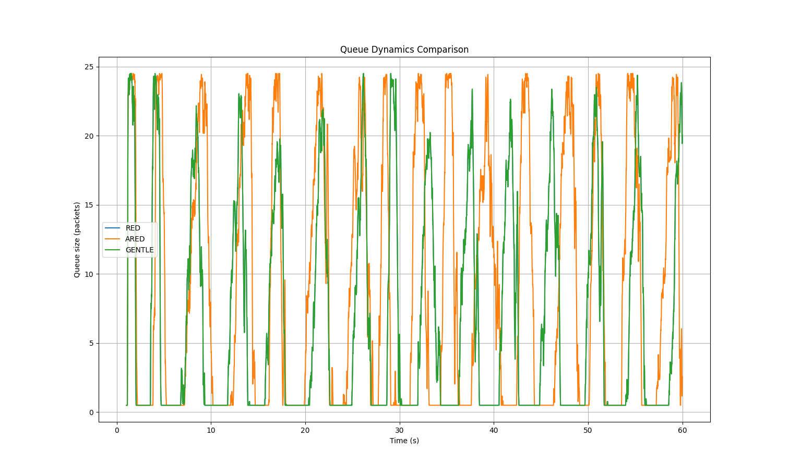
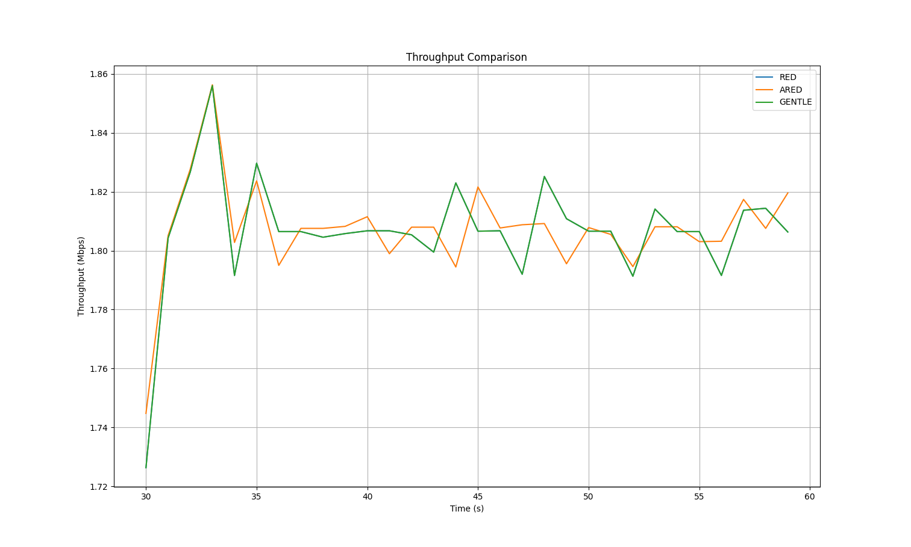
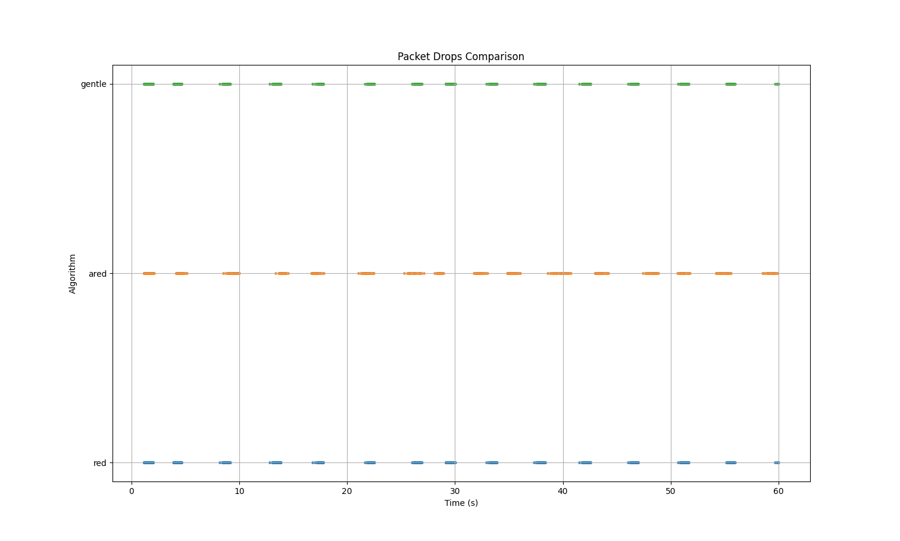

# Сравнительный анализ алгоритмов AQM: RED, ARED, Gentle RED

**Симулятор:** ns-3, программа `red.cc`  
**Топология:** 20 отправителей → маршрутизатор (AQM) → 1 получатель  
**Узкое место:** 1 Мбит/с, задержка 10 мс | **Быстрые каналы:** 1 Мбит/с, задержка 2 мс  
**Пороги очереди:** minTh = 5 пакетов, maxTh = 10 пакетов  
**Длительность:** 59 секунд (первая секунда — прогрев, исключена из анализа)  
**Транспорт:** TCP BulkSend, размер сегмента 512 байт  

---

## 1. Динамика очереди (Рисунок 1)

На рисунке представлено изменение размера очереди в пакетах на протяжении всей симуляции.

Все три алгоритма демонстрируют характерную пилообразную форму, обусловленную механизмом управления перегрузкой TCP: очередь быстро заполняется до максимума (~25 пакетов), после чего алгоритм AQM начинает сбрасывать пакеты, TCP снижает окно, и очередь опустошается почти до нуля. Период одного такого цикла составляет приблизительно 2–5 секунд.

**RED и Gentle RED** (синяя и зелёная линии) практически полностью перекрываются на протяжении всей симуляции — их кривые неразличимы. Это подтверждает вывод о том, что результаты двух запусков идентичны (см. раздел 5).

**ARED** (оранжевая линия) ведёт себя заметно иначе: «провалы» очереди менее глубоки — очередь реже опускается до нуля и быстрее возвращается к высоким значениям. Это отражает адаптивное снижение вероятности сброса `maxP` в периоды недозагрузки: ARED позволяет очереди накапливаться сильнее, прежде чем начать активно дропать пакеты.

| Алгоритм | Среднее (пкт) | Медиана | p90 | p99 | Доля пустой очереди |
|----------|---------------|---------|-----|-----|---------------------|
| RED      | 6.49          | 1       | 19  | 24  | 26.2%               |
| ARED     | 8.97          | 5       | 23  | 25  | 21.1%               |
| Gentle   | 6.49          | 1       | 19  | 24  | 26.2%               |

Среднее заполнение очереди у ARED на **38% выше**, чем у RED (8.97 против 6.49 пакетов). Медиана очереди у ARED — 5 пакетов (ровно на уровне minTh), тогда как у RED — 1 пакет, то есть большую часть времени очередь RED почти пуста.

---

## 2. Пропускная способность (Рисунок 2)

На рисунке показана сглаженная пропускная способность (скользящее среднее с окном 30 отсчётов) в диапазоне от ~30 до 60 секунд — именно с этого момента сглаживание накапливает достаточно данных для корректного отображения.

Все три алгоритма обеспечивают практически одинаковую среднюю пропускную способность около **1.805 Мбит/с**, что соответствует высокой загрузке канала (~90% от номинала 2 Мбит/с с учётом заголовков TCP/IP).

| Алгоритм | Среднее (Мбит/с) | Стд. откл. | Мин.  | Макс. | КВ    |
|----------|------------------|------------|-------|-------|-------|
| RED      | 1.8052           | 0.3879     | 0.930 | 3.285 | 21.5% |
| ARED     | 1.8053           | 0.3993     | 0.614 | 3.605 | 22.1% |
| Gentle   | 1.8052           | 0.3879     | 0.930 | 3.285 | 21.5% |

Характерная точка на графике — пик около t = 33 с, где все кривые кратковременно достигают ~1.855 Мбит/с: это совместный «выброс» после синхронного восстановления TCP-потоков после периода сброса пакетов.

ARED (оранжевая линия) колеблется несинхронно с RED и Gentle — его осцилляции сдвинуты по фазе. Это следствие адаптации `maxP`: ARED управляет сбросами в другие моменты времени, что нарушает синхронизацию TCP-потоков относительно двух других алгоритмов. Диапазон ARED немного шире (мин. 0.614 против 0.930 Мбит/с), что отражает периодические более агрессивные коррекции `maxP` в обе стороны.

Принципиальный вывод: **ни один из алгоритмов не жертвует пропускной способностью** — все три удерживают линк близко к насыщению.

---

## 3. Сбросы пакетов (Рисунок 3)

На рисунке показаны моменты сброса пакетов для каждого алгоритма в виде точечного графика. Каждая точка соответствует одному сброшенному пакету.

Хорошо видна **кластерная структура**: сбросы концентрируются в коротких интервалах (пакетные «всплески»), разделённых промежутками без сбросов. Эта структура соответствует пилообразной динамике очереди: сбросы происходят на пиках заполнения, после чего очередь опустошается и сбросов нет до следующего цикла.

**RED и Gentle RED** (синяя и зелёная строки) демонстрируют идентичные моменты сбросов — кластеры совпадают по времени и плотности, что наглядно подтверждает идентичность их выходных данных.

**ARED** (оранжевая строка) показывает принципиально иную картину:
- Кластеры сдвинуты относительно RED/Gentle по времени;
- Плотность точек внутри кластеров ниже — сбросы более равномерно распределены;
- Между кластерами наблюдаются одиночные сбросы, нетипичные для RED.

| Алгоритм | Всего сбросов | Частота (сбр./с) | Средний интервал |
|----------|---------------|------------------|------------------|
| RED      | 860           | 14.62            | 68.5 мс          |
| ARED     | 795           | 13.54            | 74.0 мс          |
| Gentle   | 860           | 14.62            | 68.5 мс          |

ARED сбрасывает на **7.6% меньше пакетов** при той же пропускной способности. Средний интервал между сбросами у ARED на 8% больше (74.0 против 68.5 мс), что свидетельствует о более «мягком» управлении перегрузкой.

---

## 4. Сводная таблица

| Метрика                    | RED          | ARED         | Gentle       |
|----------------------------|--------------|--------------|--------------|
| Средняя пропускная способность | 1.805 Мбит/с | 1.805 Мбит/с | = RED        |
| Средний размер очереди     | 6.49 пкт     | **8.97 пкт** | = RED        |
| Медиана очереди            | 1 пкт        | **5 пкт**    | = RED        |
| Доля времени выше minTh    | 41.4%        | **51.2%**    | = RED        |
| Всего сбросов              | 860          | **795**      | = RED        |
| Частота сбросов            | 14.62/с      | **13.54/с**  | = RED        |
| Характер сбросов           | кластерный   | равномерный  | = RED        |

---

## 5. Ключевое замечание: Gentle RED = RED

Все три файла данных для Gentle RED (очередь, сбросы, пропускная способность) **побайтово идентичны** данным RED. На рисунках 1–3 кривые RED и Gentle полностью перекрываются.

Конфигурация `gentle.txt` корректно задаёт `aqm=GENTLE`, а в `red.cc` соответствующая ветка устанавливает `Gentle=BooleanValue(true)`. Тем не менее Gentle RED должен отличаться от RED: при очереди выше `maxTh` он вдвое снижает наклон кривой вероятности сброса, достигая вероятности 1.0 лишь при заполнении `2*maxTh = 20` пакетов. Поскольку p99 очереди составляет 24 пакета, этот диапазон регулярно задействуется — и разница должна быть видна.

**Вероятные причины:**
1. Симуляция Gentle не была перезапущена после изменений, и выходные файлы содержат данные от предыдущего запуска RED;
2. Атрибут `Gentle=true` перекрывается глобальными настройками по умолчанию `ns3::RedQueueDisc` (следует проверить через `Config::SetDefault`).

**Рекомендация:** перезапустить симуляцию Gentle RED и убедиться, что файлы `gentle_*.csv` действительно обновились по временным меткам.

---

## 6. Выводы

1. **ARED превосходит RED по числу сбросов** при эквивалентной пропускной способности: 795 против 860 сбросов (-7.6%). Адаптивный механизм позволяет удерживать линк ближе к насыщению и менее агрессивно реагировать на временную недогрузку.

2. **ARED поддерживает более заполненную очередь** (среднее 8.97 vs 6.49 пкт), что увеличивает буферизующую ёмкость при всплесках трафика, но также увеличивает среднюю задержку пакетов в очереди — компромисс, характерный для адаптивных алгоритмов.

3. **Сбросы ARED более равномерны во времени** (рис. 3), что снижает вероятность глобальной синхронизации TCP-потоков и улучшает справедливость разделения канала между отправителями.

4. **Результаты Gentle RED недостоверны** и требуют повторного эксперимента.
